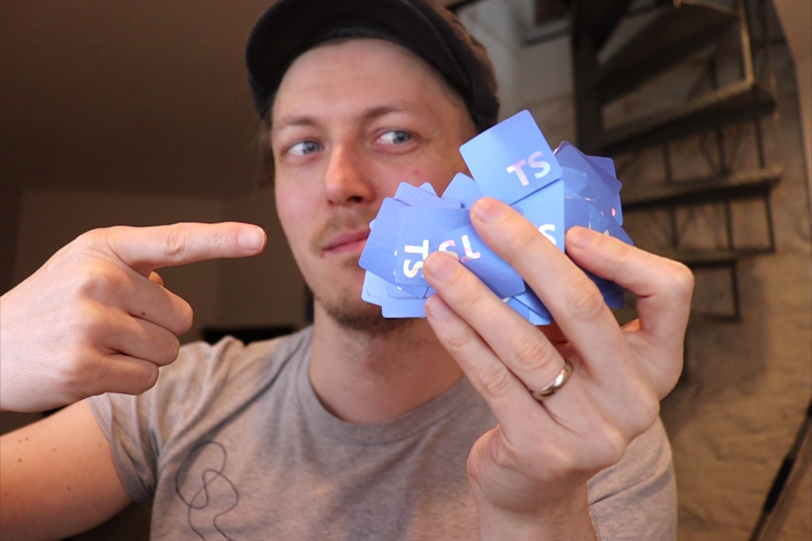
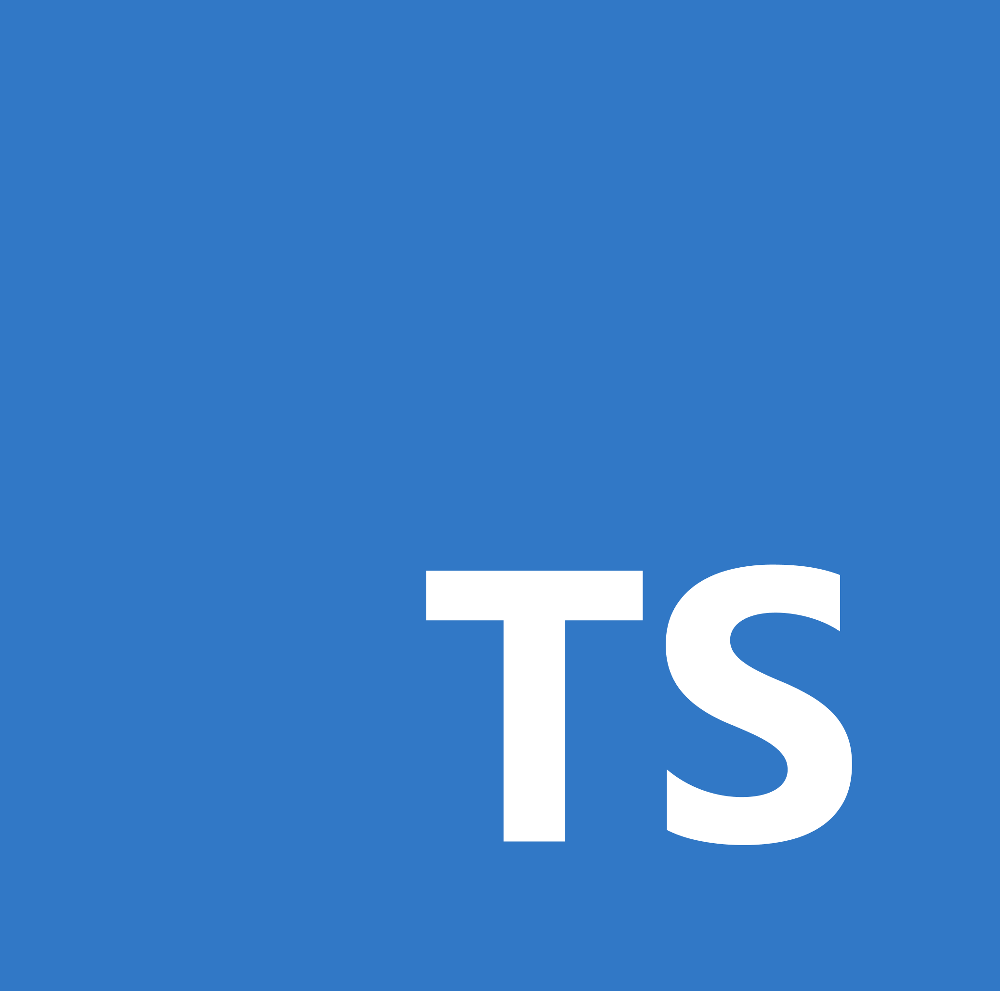

## Stickers for TypeScript

The ~~"unofficial"~~ [logo for TypeScript](https://www.staging-typescript.org/branding)

| Sticker       | Size           | Description |
| ----------------- |:-------------:| :----- |
|  | 1" x 1" | The image for tiny tiny stickers, where the "TS" would be tiny and hard to read otherwise |
|  | 2" x 2" | The **default** size + image for TypeScript stickers |
|  | 3" x 3" | We made the TS a bit smaller to make it fit well |
|  | 4" x 4" | Even smaller! |

Some fun shiny stickers

| Sticker       | Size           | Description |
| ----------------- |:-------------:| :----- |
|  | 1.23" x 1.22" | [StickerYou Holographic Die-Cut Stickers](https://www.stickeryou.com/products/holographic-die-cut-stickers/857?utm_campaign=holographiccontentlaunch05052020&utm_medium=email&utm_source=klaviyonewsletter&_ke=eyJrbF9lbWFpbCI6ICJzdGlja2VyeW91QG9ydGEuaW8iLCAia2xfY29tcGFueV9pZCI6ICJKTVF0ZlYifQ%3D%3D) ) |

Some fun longer stickers

| Sticker       | Size           | Description |
| ----------------- |:-------------:| :----- |
|  | 1" x 1" | TS Error BSOD (/ht [@mtrebizan](https://twitter.com/mtrebizan/status/1171524687504924673)) |
|  | 4" x 4" | I interface, therefore, I type |
|  | 2" x 2" | A strongly made bet |
|  | 3" x 3" | I can make sense of this, sure |

The source of truth for the stickers is [this Sketch file](./stickers.sketch)
